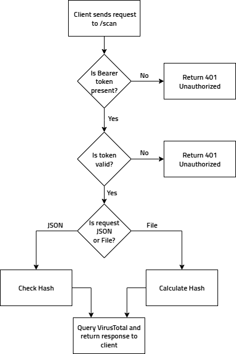

# 🛡️ HashChecker

**HashChecker** is a security-focused web application built as part of my effort to pursue hands-on learning and deepen my understanding of Cybersecurity concepts.

The app simulates a realistic threat detection pipeline: the backend is deployed with Docker on an AWS EC2 instance, while the frontend is a locally running React interface that allows users to scan files or hashes using the VirusTotal API.

## What It Does
- Accepts file uploads or direct hash input (SHA-256)
- Calculates the hash of the uploaded file automatically
- Sends the hash to the VirusTotal API for analysis
- Displays the number of antivirus engines that marked the file as:
  - Harmless
  - Malicious
  - Suspicious
  - Undetected
- Saves the scan result as a `.json` file (locally on the backend)
- Shows results in a clean, web-based user interface
- Can be used both locally and from a cloud deployment

## Tech Stack
| Layer       | Technology               |
|-------------|---------------------------|
| Frontend    | React, TypeScript, Vite   |
| Backend     | Python, Flask             |
| API Service | VirusTotal REST API       |
| Deployment  | AWS EC2                   |
| Container   | Docker                    |
| Security    | Static Bearer token auth  |

## Architecture Overview
This diagram shows how the components communicate with each other, from local UI interaction to external hash checker.

**Request Flow**: This diagram illustrates how the backend validates and processes each request sent to the `/scan` endpoint.

## Setup Instructions
**Notes about API Access Control**: The backend uses a simple Bearer token authentication to protect the /scan endpoint. Make sure you set the VITE_API_TOKEN in your frontend .env to match the API_TOKEN used by the backend. Requests without a valid token will receive a 401 Unauthorized response.

Note: This is a basic mechanism for demo purposes — in production you should replace it with proper authentication and secret management.

**Backend**:
1. Configure the .env file
2. Build and run the backend with Docker:

`docker build -t hashchecker-backend . `

`docker run -d -p 8080:8080 --env-file .env hashchecker-backend`

**OR** run it directly with Python for local dev:

`pip install -r requirements.txt`

`python app.py`

**Frontend**:
1. Navigate to the frontend directory:

`cd ../frontend`

2. Create a .env file:

`VITE_API_URL=http://ec2-ip>:8080`

`VITE_API_TOKEN=test`

3. Install dependencies and run:

`npm install`

`npm run dev`

**Make some tests**:

`curl -X POST http://localhost:8080/scan -H "Bearer: test" -H "Content-Type: application/json" -d "{\"hash\": \"44d88612fea8a8f36de82e1278abb02f\"}"` - it's a hash of a virus file, so it will return some results from the scanning engines

## Cloud Deployed
TBE

## Screenshots
TBE

## Disclaimer
TBE
