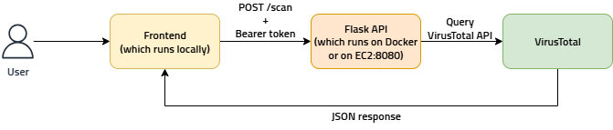

# 🛡️ HashChecker

**HashChecker** is a security-focused web application built as part of my effort to pursue hands-on learning and deepen my understanding of Cybersecurity concepts.

The app simulates a realistic threat detection pipeline: the backend is deployed with Docker on an AWS EC2 instance, while the frontend is a locally running React interface that allows users to scan files or hashes using the VirusTotal API.

## What It Does
- Accepts file uploads or direct hash input (SHA-256)
- Calculates the hash of the uploaded file automatically
- Sends the hash to the VirusTotal API for analysis
- Displays the number of antivirus engines that marked the file as:
  - Harmless
  - Malicious
  - Suspicious
  - Undetected
- Saves the scan result as a `.json` file (locally on the backend)
- Shows results in a clean, web-based user interface
- Can be used both locally and from a cloud deployment

## Tech Stack
| Layer       | Technology               |
|-------------|---------------------------|
| Frontend    | React, TypeScript, Vite   |
| Backend     | Python, Flask             |
| API Service | VirusTotal REST API       |
| Deployment  | AWS EC2                   |
| Container   | Docker                    |
| Security    | Static Bearer token auth  |

## Architecture Overview
This diagram shows how the components communicate with each other, from local UI interaction to external hash checker.

**Request Flow**: TBE

## Setup Instructions
**Notes about API Access Control**: TBE
**Backend**: TBE
**Frontend**: TBE

## Cloud Deployed
TBE

## Screenshots
TBE

## Disclaimer
TBE
